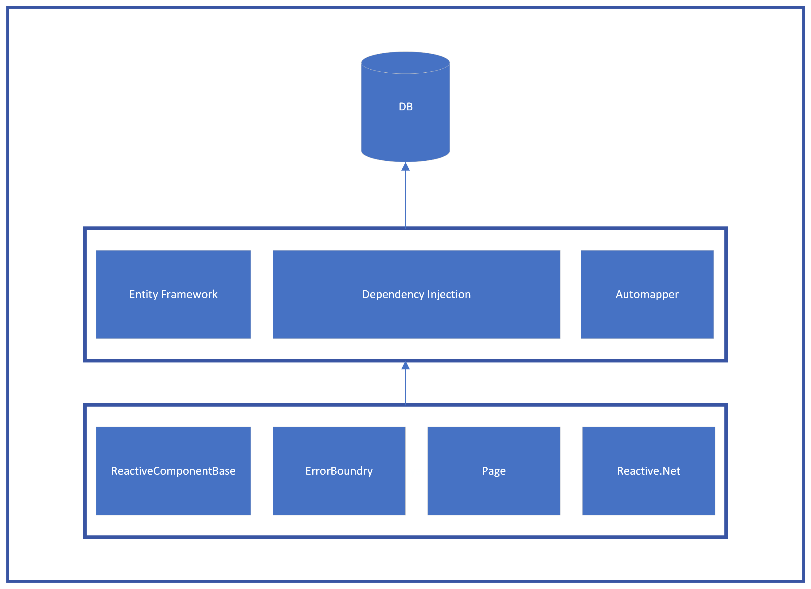

# Chinook

This application is unfinished. Please complete below tasks. Spend max 2 hours.
We would like to have a short written explanation of the changes you made.

1. Move data retrieval methods to separate class / classes (use dependency injection)
2. Favorite / unfavorite tracks. An automatic playlist should be created named "My favorite tracks"
3. Search for artist name

Optional:
4. The user's playlists should be listed in the left navbar. If a playlist is added (or modified), this should reflect in the left navbar (NavMenu.razor). Preferrably, this list should be refreshed without a full page reload. (suggestion: you can use Event, Reactive.NET, SectionOutlet, or any other method you prefer)
5. Add tracks to a playlist (existing or new one). The dialog is already created but not yet finished.

When creating a user account, you will see this:
"This app does not currently have a real email sender registered, see these docs for how to configure a real email sender. Normally this would be emailed: Click here to confirm your account."
After you click 'Click here to confirm your account' you should be able to login.

Please send us a zip file with the modified solution when you are done. You can also upload it to your own GitHub account and send us the link.

## Explanation

1. Service classes are created to access the db context. All the classes are injected using DI. Loading all artist with all the albums seems to the quickest way to get the album count. But this may lead to performance issues. Did not work on any optimizations because current dataset seems to working without any lags.
2. "My favorite tracks" playlist is created when first track is marked as favorite. Toggle favorite method is using to reduce the code duplication. A constant is used avoid typo's when comparing the playlist name.
3. Search text box is added on top of the artist's page. No debounce operator is implemented because search happens when 'Enter' is pressed.
4. Reactive.NET is used to show the user playlists on the nav menu without refreshing the page.
5. Add tracks to playlist is implemented to create a new playlist if a new name is given. If the playlist with the same name is existing the backend adds the track to exiting playlist without raising exceptions. If the name is not provided track will be added to playlist selected on the dropdown.

* Few extension methods were implemented to keep the code clean.
* No unit tests are implemented.
* Error boundry is implemented to handle exceptions commonly.